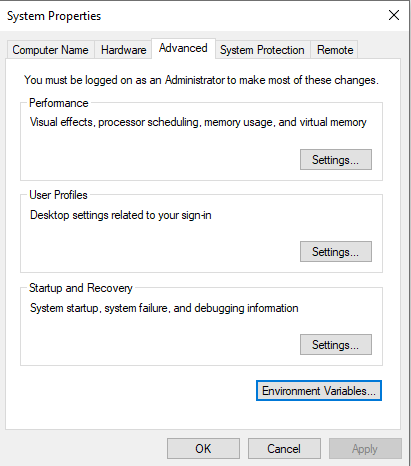

# Build a Python Environment for Using the FLDPLN Model

To use the FLDPLN model with Python, we need to build a Python environment with the necessary packages installed. This document provides information on how to build the "fldpln_fim" Python environment and how to use it in JupyterLab and Visual Studio Code (VSC). It includes the following major steps:
* Create the fldpln_fim Python environment and install dependent Python packages.
* Install the FLDPLN model Python package (fldpln_model) in the fldpln_fim environment and MATLAB Runtime.
* Install FLDPLN tiling and mapping Python package (fldpln) in the fldpln_fim environment. 

## Create the fldpln_fim Python Environment

### Install Miniconda

Miniconda is a lightweight version of Anaconda, which is a full-fledged data science platform. Miniconda only includes Python and conda, while Anaconda includes Python, conda, and a suite of other common used packages. If you already have Miniconda installed on your computer. You can skip the rest of this step.

* Go to the [Miniconda download page](https://docs.conda.io/en/latest/miniconda.html#windows-installers) and download the Miniconda installer for Windows or the OS system of your computer. The web site provides the installer with the most recent Python version. This is fine as we can create a Python environment with the desired Python version later.
* Run the installer and follow the instructions to install Miniconda on your computer.

### Create the environment and install packages using a YAML file

We will create the fldpln_fim environment using a YAML file instead of installing the dependent packages individually. You can download the [fldpln_fim YAML configuration file](https://github.com/XingongLi/fldpln/blob/main/tutorials/fldpln_fim.yml) from Github where this document is located. 

Search and open an Anaconda Prompt command window from the Start button on Windows. The base Python environment was automatically created and set as the default Python environment. In the command window, navigate to the folder where the YAML file is saved, and run the following conda command to create the fldpln_fim environment:
```
conda env create -f fldpln_fim.yml
```
**Be patient as installing all the dependent packages might take a while!**

## Install FLDPLN Related Python Packages

Currently, there are two python packages are needed for using the FLDPLN model. The first is the fldpln_model Python package compiled from MATLAB-based FLDPLN model for running the model through Python. The second is the fldpln package, which contains several modules for tiling and mapping FLDPLN libraries.  

### Install the fldpln_model Python Package

The FLDPLN model is originally developed in MATLAB and compiled into the fldpln_model Python package. The MATLAB compiled Python package can be installed on either Windows or other supported OS systems with the MATLAB Runtime installed. Note that the MATLAB Runtime is free but required to use the compiled fldpln_model Python package.

Two kinds of installers are available to install the fldpln_model package and MATLAB Runtime it depends on. The [smaller installer](https://github.com/XingongLi/fldpln/blob/main/fldpln_model/fldpln_model_Installer_web.exe) available on Github download the MATLAB Runtime on-the-fly during the installation and the [larger installer](https://kbs-karsfl-pc01.home.ku.edu/download/fldpln_model_windows_installer_offline.exe) available on KU KBS-KARS server has the Runtime included in the installer. Whichever installer is used, it will install the MATLAB Runtime and the fldpln_model package under the same or different folders. 

Note that MATLAB Runtime requires 3 GB disk space and takes time to download and install. Also note that the installer for Windows automatically sets the MATLAB Runtime path during installation, but on Linux or macOS you must add the Runtime manually. See [here](https://www.mathworks.com/help/compiler_sdk/cxx/mcr-path-settings-for-run-time-deployment.html) for more information.

Open an Anaconda Prompt command window, navigate to the application folder under where the fldpln_model is installed (i.e., fldpln_model/application, where file setup.py is located), and activate the fldpln_fim environment:
```
conda activate fldpln_fim
```
To install fldpln_model package into the fldpln_fim environment, use either one of the following commands. This procedure is necessary as the fldpln_model package is created by MATLAB as a special Python package.
```
pip install .
```
or
```
python setup.py install
```

### Install the fldpln Package

The [fldpln Python package](https://pypi.org/project/fldpln/) provides several modules to tile segment-based FLDPLN libraries and map flood inundation depth using the tiled libraries. The [documentation](https://xingongli.github.io/fldpln/) on those modules are available on GitHub. The package is published on PyPI and can be installed using:
```
pip install fldpln
``` 

## Using the fldpln_fim Environment in Different Development Environments

The fldpln python environment can be used in different development environments including JupyterLab and Visual Studio Code (VSC).

### Use the fldpln_fim environment in JupyterLab

We have installed the jupyterlab package into the fldpln_fim environment. We need to open an Anaconda Prompt command window, activate the fldpln_fim environment, and navigate to the folder where the notebooks are located and run the following command to start JupyterLab in a web browser. Note the space between the two words.
```
jupyter lab
```
You can shutdown the local JupyterLab server by using "Ctrl + C" in the command window where you typed in the above command.

### Use the fldpln_fim environment in Visual Studio Code (VSC)

The fldpln_fim environment should be directly available in VSC after for writing Python scripts and notebooks. Below are some trouble shooting steps if the environment is not available in VSC.
* Make sure the conda command is added to you computer system’s PATH environment variable so that VSC can use it to activate a specific python environment.
  * When installing miniconda, the default installation setting doesn’t add its miniconda executable path to the PATH environment variable.
  * This is can be done by using the Advanced System Settings in Control Panel (see the screenshot below)

    
* VSC terminal 
  * VSC uses powershell as the default terminal which cause some issues even after including conda path in the PATH environment variable.
  * A quick solution is to change the default powershell terminal in VSC to the regular cmd terminal by press CTRL+SHIFT+P in VSC and search for “terminal select default profile” and select “Command Prompt C:\WINDOWS\System32\cmd.exe”
* VSC also supports Jupyter notebooks. But it needs the ipython kernel package be installed into the environment. The kernel can also be installed when you open a notebook in VSC and choose the fldpln_fim environment. You can also install the package into the fldpln_fim environment by:
  ```
  conda install -c conda-forge ipykernel
  ```